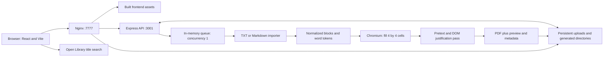

# MicroBook Maker: architecture and product direction

Initial audit: September 4, 2026. Direction revised September 5, 2026. Source baseline: `43f3a28` on `master`.

The product's defining feature is fitting an entire book onto a handful of double-sided sheets. The owner likes the current printed output and has used it for years. The next version should preserve that density, physical format, and familiar defaults while improving import, navigation within dense text, preview, and the application interface. The UI can be completely redesigned: the owner's stated preference is a default dark/navy theme, exceptionally clean, with no unnecessary elements or explanatory text.

This is a proposal and audit. Application code and production configuration were not changed.

**Recommendation**

Build a compact studio around the existing microbook format. Keep React/Vite, the self-hosted TrueNAS container, and Chromium PDF export. The current scope excludes multi-user accounts, login, Cloudflare, and cloud deployment. Prioritize the navy interface, an accurate preview, browser-persisted settings, and a richer EPUB layout alongside the unchanged Classic renderer.

Use two output modes: **Classic**, which preserves today's generation behavior, and **Book**, which preserves EPUB structure and illustrations while compacting typography and spacing. These are independent of the preview's Cell/Sheet view switch. Compact paragraph, scene, and chapter markers belong among Book mode's settings; they must not silently alter Classic. Any additional glyph can affect pagination near a sheet boundary, so show the actual change in physical sheet count.

The supplied `recursion.pdf` is a useful visual reference: its header reports 90,255 words; inspection confirms 11 Letter PDF sides, requiring six duplex sheets. The sampled body text is 4.5 pt Arimo, corresponding to the application's CSS-pixel size 6. All eleven sides were inspected as a contact sheet, with full-size first-cell, middle-side, and final-side checks. Chapter names, dates, and prose currently run together. This supports adding hierarchy without replacing the dense physical format. The original EPUB was not supplied, so source-to-export content fidelity has not been checked. This personal book should remain a local reference rather than a committed test fixture.

**What was verified**

| Evidence | Result |
| --- | --- |
| Live application | Opened and visually inspected at `http://truenas-scale:7777/`. |
| Production/source correspondence | SHA-256 hashes match for backend entry point, page template, document pipeline, token styles, and Nginx configuration. Live frontend JS/CSS asset names match the locally built assets. This is a targeted comparison, not a hash of the entire container. |
| Actual deployment image | `dovieuu/microbook-maker:layoutfix-2026-06-01`; the Compose example says `latest`. The deployed code is more informative than the tag's date. |
| Current workload snapshot | 86 completed jobs, no running/queued jobs at the API check. 52 historical entries have the title `Unknown`; 10 entries report screenshot artifacts. |
| Recent production job | 106,029 words; 13 Letter PDF pages/sides; 7 physical duplex sheets; 1,935,516-byte PDF. Creation-to-output timestamps span 47.026 seconds. This includes the job lifecycle and is not a CPU profile or a representative benchmark distribution. |
| Layout report for that job | 202 populated cells; 200 analyzed; 200 horizontally justified; 108 vertically justified; optimization took 3.863 seconds and was not truncated. |
| Printed artifact | Downloaded the most recent PDF for local inspection; rendered and inspected its first page. `pdfinfo` confirms 13 Letter pages. Actual printing/folding was not performed. |
| Local checks | Backend: 53 tests passed. Frontend: 90 tests across 13 files passed. TypeScript/Vite production build passed. Frontend tests emit React `act` warnings. |
| Responsive review | Desktop screenshot inspected. Mobile screenshot capture timed out; mobile visual acceptance remains unverified. |

No new production job was submitted, no existing job was deleted, and the running job observed on initial page load was allowed to finish.

**How the system works today**



The production container bundles Nginx, Node/Express, PM2, Chromium, and fonts. Two persistent directories contain originals and generated files. There is no database and no authenticated ownership model. API and filesystem state are organized around generation jobs.

The frontend's active path is `App.tsx` → two context providers → `MicroBookStudio.tsx`. Hooks own book details, file state, options, generation, and history. Radix/Tailwind components power the current screen. Older Material UI components and a Zustand store remain in the repository; the active studio does not use that store. A new framework is not needed to improve the UI.

Selecting a source file reads it as text in the browser, estimates words/sheets, and automatically searches Open Library using the filename-derived title. Upload sends multipart data and settings to Express. Multer stores the source with a generated name, metadata is written to JSON, and the job enters the in-process queue. The HTTP response returns the job ID while generation continues.

TXT blank lines become paragraph blocks. Markdown supports more structure, including headings, inline emphasis, lists, quotes, and links. Normalization then reduces these to a small common representation. Rendering serializes them into word/link/break tokens, launches Chromium, fills sixteen cells on each Letter side, and applies a later justification pass. PDF pages are filled in grid order; this is a particular existing fold/read format, not a generic imposed booklet signature.

The renderer writes HTML, metadata, a first-page PNG, progress files, and a PDF. Nginx serves generated files and originals directly. History lists files and reconstructs jobs from them. Active job progress is polled, with the history hook checking every two seconds.

**What is already good**

- The physical output format is useful and proven through real use. Preserve its cell order, margins, fold gaps, duplex behavior, type size, and compact headers as a regression baseline.
- TXT/Markdown importers already feed a common document model. EPUB has a natural insertion point.
- Job IDs and upload filenames are generated independently of the book title; the old notes' title-derived filename warning is no longer an accurate description of new jobs.
- The queue already limits simultaneous Chromium work. There is crash handling and persistent progress/metadata.
- Backend capabilities supply supported formats and available fonts to the frontend.
- The current tests and frontend build pass. The old refactor document mixes completed work with outdated findings; it should not be treated as a fresh audit.

**The changes with the most value**

| Finding | Why it matters | Proposed change |
| --- | --- | --- |
| Paragraph tokens render as collapsible spaces (`be/index.js`, `buildNode`; `tokenStyles.js`). | The source can know where paragraphs begin while the printed result loses that cue. | Keep boundaries in the model; optionally render a compact pilcrow, with no blank line. |
| A heading, quote, link, or code token can disqualify a whole cell from horizontal justification (`applyHorizontalJustification`). | Adding EPUB structure naively could reduce the density/appearance the owner likes. | Apply body justification by text run/flow region, preserving compact structural markers and a deliberate treatment of headings. |
| Pagination mutates text and reads `scrollHeight`/`clientHeight` for each token. Pretext is currently a later optimization pass. | This is a likely source of avoidable layout work. | Profile first, then predict fits in larger batches using cached measurements and verify bounded boundaries in the browser. |
| Justification stops after 320 analyzed cells or four seconds. | Longer books can get differing treatment in later cells. | Make the layout policy consistent across the document and expose completion of any optional optimization. Do not simply remove the cap before measuring cost. |
| Statistics use hard-coded words-per-sheet tables, duplicated across client/server. Metadata can retain estimated rather than actual sheet counts. | The most important user promise is how much paper the book needs. | Distinguish estimate from measured result; use actual rendered side count for final physical sheets and saved metadata. |
| Type size `6` is injected as CSS pixels, not points. | Relabeling it as “6 pt” during a redesign would silently enlarge print by one third. | Preserve the current physical size. If adopting points, migrate explicitly: 6 CSS px corresponds to 4.5 pt at standard CSS print scaling. |
| Preview PNGs exist, but history uses a decorative placeholder; there is no authoring preview. | Existing useful output is hidden from the interface. | Use real previews, with an enlarged cell view and a whole-sheet view. |
| The active options reducer has fixed defaults and no browser persistence; the unused Zustand store does not solve this. | Reloading loses the user's usual settings. | Use one versioned preferences store, with validation and migration, persisted in localStorage. |
| History occupies a permanent major column; the hero occupies another. Source selection comes after metadata/settings. | The current book gets little attention or feedback. | Source first; small app header; preview-centered workspace; history in a Library view. |
| “Reuse” reconstructs a text Blob and reruns filename lookup instead of reliably restoring the whole saved project. | EPUB is binary, and user-edited metadata should survive reuse. | Reuse source bytes or a document ID and restore the saved metadata/settings without overwriting them from a new lookup. |
| The active UI has an immediate destructive Delete action, including for running jobs. | Stopping generation and removing the original are distinct intentions. | Separate Cancel, Remove export, and Delete project; support recoverable removal where practical. |

Some additional correctness paths deserve targeted tests during implementation: oversized tokens can exhaust the placement retry loop, the final “THE END” marker is appended without a fit check, and styled inline segments currently lose adjacency information during whitespace normalization. These are code-review risks, not claims of missing text in the inspected production book.

**Dense output with more character**

Keep continuous, justified prose. Start with three useful controls rather than a publishing suite:

| Boundary | Compact representation | Behavior |
| --- | --- | --- |
| Paragraph | `¶` or a tiny square | Inline; no forced newline; attach to the following text so it cannot hang at the end of a cell. |
| Scene break | `◆` | Distinct from a paragraph; modest separation while remaining in the dense flow. |
| Chapter | `§ 03 · Chapter title` in compact bold | Avoid an orphan heading. Offer a new-line treatment as an explicit option; no automatic new sheet. |
| Original source page | `[p. 23]`, optional | Include only when the EPUB supplies a real page label; do not invent page numbers from reflowable content. |
| New microbook cell | Existing cell/sheet navigation | This is output pagination, not a new source paragraph or chapter. |

Print markers in monochrome and test them at the current physical size. Preview enlargement must not change exported type size. In Book mode, retain content illustrations and captions by default, with an explicit text-only option. Scale images proportionally and preview their legibility at actual print size. Keep author text intact and make omissions explicit. Paragraph treatment can offer continuous text with a marker, or a new line without a blank line; chapter headings can occupy one compact bold line without forcing a new cell or sheet.

The best “smart” feature is **Find the largest text that fits N sheets**. It should search only within user-chosen bounds, preserve all selected content, and report when the target cannot be reached. It must not silently shorten the book or reduce type below the chosen minimum. Another valuable feature is **compare with my usual settings**, showing actual sheet-count differences once measured.

Other small features with good payoff: saved printer/fold presets, a chapter-to-sheet index that can fit into existing header space, export just the sheet that needs reprinting, and an optional numbered folding/calibration sheet. These should preserve the established fold pattern until physical validation supports a change.

**EPUB import scope**

Treat EPUB as a structured book, not a ZIP full of text files. Follow `META-INF/container.xml` to the package document; use its manifest and spine to resolve reading order. Read title/author/language metadata, navigation, XHTML semantics, styles, and assets. Expand the current document model before importing: its current word/break representation cannot faithfully retain all this information. EPUB page labels are separate from generated PDF pagination. These structures are defined in [EPUB 3.3](https://www.w3.org/TR/epub-33/).

The initial supported scope should be DRM-free, reflowable EPUB 2/3 prose, including illustrations. Handle EPUB 2 NCX navigation as well as EPUB 3 navigation. Preserve paragraphs, chapter headings, nested inline emphasis, scene breaks, explicit page labels, notes, images, and captions. Preserve line-sensitive content such as poetry and lists. Keep footnotes as compact notes or collected endnotes according to a selected policy. Identify unsupported fixed-layout books clearly. Embedded font obfuscation needs separate handling from book encryption; start with the bundled print font while retaining semantic emphasis, and evaluate publisher fonts as a separate compatibility feature.

“Faithful” should mean faithful content, order, hierarchy, and meaningful styling. A reflowable EPUB does not have one immutable page layout. Preserve its supported XHTML structure and scoped styling, then apply a compact print stylesheet: reduce margins and heading sizes, remove unnecessary forced page breaks, justify prose, and bound image dimensions. Exact publisher spacing/pagination conflicts with the dense microbook objective. Fixed-layout comics, wide tables, and heavily designed pages are separate layout problems, not an automatic promise of support.

Chromium can handle supported HTML/CSS, images, and text shaping. Pretext can help measure text and place lines; its rich-inline module is deliberately narrow and does not replace an HTML/EPUB layout engine. Prototype a representative chapter containing headings, nested emphasis, a note, and an illustration before choosing the new compositor. Preserve the existing 4-by-4 cell arrangement and reading order.

Let the import review select which sections to include. Show front matter, contents, main text, and notes when identifiable; keep all selected content by default. Do not silently remove publisher pages, dedications, notes, or anything guessed to be boilerplate. For TXT, offer soft-wrapped-paragraph and line-preserving interpretation with a sample preview; structure detection remains heuristic.

EPUB also changes engineering requirements: preserve source bytes on reuse; cap expanded ZIP size and entry count as well as upload size; reject path traversal; disable external XML entities, scripts, and remote resource fetching. Sanitize XHTML, constrain supported CSS, resolve assets locally, and isolate book styles from the application interface. Trusted renderer templates should receive validated book content and style data. Ship import fixtures with nested emphasis, punctuation adjacency, multiple spine items, notes, images, explicit page markers, and malformed archives.

**The interface I would build**

The opening state should be a simple drop area for EPUB, TXT, or Markdown, with Library available. Once a book is loaded, the same screen becomes a workspace:

1. A compact header: MicroBook, book title, Library, Export PDF.
2. The main surface: a sheet preview and an enlarged reading-cell view. Clicking a cell enlarges it; chapter selection moves the preview to the relevant location.
3. A compact toolbar: Classic/Book, the familiar type size/font settings, and Settings. Put paragraph treatment, heading/image options, line spacing, margins, fold settings, and metadata in a collapsible panel; retain a quiet default workspace.
4. A concise status line: estimated or measured physical sheets, duplex sides, and real generation phase. Avoid unexplained percentages.

A dark navy interface should give the actual white printed sheet visual priority. Use one restrained accent, compact controls, readable labels, strong contrast, and modest rounding. Remove the tagline, hero column, decorative cards, repeated labels, and persistent explanatory copy. Keep contextual help in deliberate disclosures. Paper texture and a warm editorial theme are not the selected UI direction.

Keep a quick path: choose file → retain usual settings → export. Do not require walking through a wizard for every book. On a phone, stack preview and settings with the main action still easy to reach. “Library” can show real thumbnails and compact rows; older missing metadata should be shown as legacy records with an editable title rather than 52 indistinguishable Unknown cards.

Persist the last mode, font, size, spacing, borders, margins, paragraph/heading/image choices, preview view, and theme automatically in the browser. Use one small versioned localStorage record with schema validation, safe defaults, and a reset action. Keep mode-specific settings separate so switching to Book does not overwrite Classic's settings. Do not put whole EPUBs or image blobs in localStorage. If restoring the current book is desired, retain its server document ID; use IndexedDB only if later adding local book storage. Browser preferences require no login or server database and remain specific to that browser and site address.

The exact preview should use the actual rendered output. The first slice can display the generated PDF and crop/enlarge its cells, then add debounced background updates. A later quick preview can share layout logic and fonts with export, but it must be visibly pending until authoritative pagination is ready. Do not regenerate a whole novel for every keystroke or show an old preview as if it used the new settings. Keep preview zoom independent of print size, preserve the reading position during changes, and use actual PDF side count for the final sheet total.

“Find book details” should be explicit or use EPUB metadata first. Today selecting a file sends its derived title to Open Library and accepts the first result. A delayed response can also conflict with manual editing or a newer selection. Prefer metadata provenance, request cancellation, and protecting user-entered values.

**Self-hosted architecture**

Keep one deployable application: React/Vite in the browser, Express for imports and jobs, Chromium for print rendering, and the existing persistent volume. No new network service is required for the requested features. Keep the queue's initial concurrency at one; parallel rendering can increase memory pressure without making an individual export faster.

Browser preferences belong in localStorage. Source files and completed exports can remain on disk. Improve restart recovery in the existing job records before considering a database; SQLite is an option if job/history management becomes awkward, not a prerequisite for the redesign.

A worker thread or browser Web Worker can later keep expensive parsing and measurements off the interface thread where the chosen libraries support it. This is an implementation choice to benchmark, not a change in hosting. Keep authoritative Chromium PDF generation on the NAS until an alternative proves identical physical output and reliable downloads.

**Recommended boundaries inside the code**

```text
source bytes
  → importers (TXT / Markdown / EPUB)
  → BookDocument (metadata, sections, blocks, inline runs, source locations)
  → layout (font metrics, markers, cell contents, sheet count)
  → existing fold arrangement (sides, cell positions, navigation)
  → renderer (preview / HTML / Chromium PDF)
```

Keep document interpretation, physical layout, and hosting adapters separate. Implement these boundaries inside a small repository; they do not require separate network services. A `BookDocument` should preserve adjacency, nested inline marks, language, chapter identity, and source anchors. Breaks should retain their kind instead of becoming whitespace early. A layout result should retain source-to-cell mappings so the preview and chapter index can navigate accurately.

Start by moving the current renderer out of the 2,083-line `be/index.js` without changing output. API handlers, job lifecycle, storage, and print layout can then change independently. There are currently empty `pdfGenerationService.js` and `contentUtils.js` files; filenames do not imply the architecture is already separated.

The owner explicitly authorized broad restructuring of folders, files, and libraries on September 5. A suitable destination is a small npm workspace with one root lockfile and shared build/test commands:

```text
apps/
  web/                 # studio, preview, settings, library, UI components
  server/              # HTTP routes, jobs, storage, Chromium lifecycle
packages/
  core/                # book model, imports, settings, runtime schemas
  renderer/            # Classic, Book, shared sheet geometry, browser entry
tests/
  fixtures/            # redistributable books and typography cases
```

Organize the web app by feature rather than spreading each feature across many generic hooks, contexts, components, and services. Break the 734-line studio into a workspace shell, preview, settings panel, source picker, and library. Use a single accessible component system based on the existing Radix primitives and the navy design tokens. Remove unused Material UI/Emotion components, demo code, example stores, and outdated migration scaffolding after confirming references.

Use TypeScript across new server and shared modules, with validated settings/API boundaries. Extract Classic with behavior preserved first; converting its internals to a new abstraction is a separate change. Consolidate persistent client preferences in a real Zustand store using its persistence middleware, keep short-lived panel state local to components, and keep job/library requests behind one data-access layer. A schema library can validate both persisted settings and HTTP inputs. These boundaries prevent the preview, exporter, and stored settings from drifting apart.

Update React/Vite and their testing tools as part of the new UI foundation. Keep React/Vite as the application model: this is a local interactive workspace, and its core rendering workload remains in Chromium. The deployment already uses Node 24. Review framework migration guides and peer dependencies before selecting the exact compatible versions; changing a major version is not itself evidence of faster PDF output. See the [React versions](https://react.dev/versions) and [Vite migration guide](https://vite.dev/guide/migration).

Fresh registry inspection on September 5 found the following installed/latest versions. This is an upgrade inventory, not a claim that the full set has been installed or validated together:

| Package | Installed | Registry latest |
| --- | --- | --- |
| React | 18.3.1 | 19.2.8 |
| Vite | 4.5.14 | 8.2.2 |
| TypeScript | 5.8.3 | 7.0.2 |
| Tailwind CSS | 3.4.17 | 4.3.3 |
| Vitest | 0.34.6 | 5.0.0 |
| Zustand | 4.5.7 | 5.0.15 |
| Express | 4.21.2 | 5.2.1 |
| Multer | 1.4.5-lts.1 | 2.3.0 |
| Puppeteer | 24.10.0 | 25.10.0 |
| Pretext | 0.0.6 | 0.0.8 |

Upgrade the HTTP/upload stack in its own verified change. Keep renderer/font/browser upgrades separate from UI tooling upgrades so Classic output differences have a clear cause. Evaluate whether the Node server can serve the built UI and files directly, allowing removal of PM2 and Nginx from this single-app container after route, streaming-download, startup, and shutdown checks; that simplification is optional and does not need to block the product work.

**Pretext and performance**

The installed and locked package is `@chenglou/pretext@0.0.6`; the declared range `^0.0.6` does not advance automatically to `0.0.8`. The npm registry reports **0.0.8** as latest on September 5, 2026. Its published package was inspected in a temporary directory without installing it into the application. The two dist entrypoints used by this app still exist, and the public layout/rich-inline function signatures are unchanged. The prepared-text internal shape adds a preferred-break array, and demo/asset package exports have been removed; this application does not rely on those demo/asset exports.

Versions 0.0.7 and 0.0.8 include improvements to punctuation, soft-hyphen and long-word wrapping, letter-spacing geometry, rich-inline overflow handling, and redundant lookup work in streaming layout. They are worthwhile correctness updates, but unchanged signatures do not guarantee unchanged PDF pagination. Fixes listed under Unreleased on the repository's main branch are not assumed to be present in 0.0.8. See the [Pretext changelog](https://github.com/chenglou/pretext/blob/main/CHANGELOG.md).

Evaluate 0.0.8 in the new layout path and compare it against 0.0.6 with a fixed local corpus. Pin Classic to its original layout dependency until visual, text-coverage, cell-boundary, and sheet-count comparisons justify a change. Record the renderer, Chromium, and font versions alongside output. A named preset alone is not enough to preserve a renderer whose dependencies change underneath it.

The larger potential speed improvement is how the app uses Pretext. Today it first places words using DOM mutation and geometry reads, then invokes Pretext during a later pass. Its documented approach prepares/caches measurements once and reuses them for cheap layout calculations. Moving suitable fit decisions ahead of DOM placement could remove repeated work, but this must be profiled and validated for narrow justified cells and rich content. Pretext is not a complete EPUB renderer. See the [Pretext documentation](https://github.com/chenglou/pretext).

Measure import, browser/font startup, token placement, justification, preview generation, and PDF writing separately, plus peak memory. The earlier production job's 47.026-second lifecycle is a single observation, not a benchmark suite. Prioritize reusable text metrics, content/settings/font-version cache keys, batched DOM updates, background pagination, and cancellation of obsolete preview requests. Reuse completed exports when source and settings are identical. Evaluate a warm Chromium process only if startup is a material part of runtime; bound and recycle it to control memory. Do not claim a speed multiplier before equivalent-output measurements.

**Reliability within the current scope**

- The in-memory queue does not survive a restart. Existing progress JSON can continue to say “in progress” after its process is gone. Reconcile interrupted jobs on startup and provide a retry path.
- Deleting a job removes the source/PDF/metadata/PNG but leaves `output_<id>.html`, which contains book text, in generated storage. Treat all derivative artifacts as part of the same lifecycle.
- `/health` is an Nginx constant response. Add a cheap backend readiness check; keep a renderer smoke separate from frequent health polling.
- Validate layout parameters on the server and resolve job IDs strictly inside their storage roots. Bound EPUB expansion and keep book scripts and remote resource requests disabled.
- The tag-triggered Docker publishing workflow does not run the existing tests. Add tests/build and a bounded render smoke before release; record source/font/Chromium versions and retain an immutable image for rollback.

**Suggested implementation order**

| Step | Deliverable | Acceptance criterion |
| --- | --- | --- |
| 1. Preserve, measure, and establish boundaries | A local output reference, redistributable fixtures, extracted Classic renderer, shared settings/types, workspace tooling, and phase timings. | Same text, physical size, cell order, side count, and fold geometry; no clipping or dropped text. Compare images/text rather than timestamped PDF binary hashes. |
| 2. Build the main UI upgrade | Updated React/Vite foundation, navy workspace, actual PDF preview with Cell/Sheet views, settings panel, browser persistence, and compact Library. | Reload restores settings; displayed output corresponds to its settings; importing and exporting with usual settings is quick. |
| 3. Prove Book mode | Structured EPUB import and one representative rich chapter using headings, emphasis, notes, and an image; evaluate Pretext 0.0.8. | Preserve selected content and reading order, expose paper cost, and retain Classic as an independent output path. |
| 4. Extend and accelerate | Full-book rich pagination, cached measurements, batching, obsolete-preview cancellation, export reuse, and job recovery. | Report measured timings; long books finish without missing content; restart leaves a recoverable job state. |
| 5. Add the useful smart control | Find the largest readable text that fits a selected number of duplex sheets, with an explicit minimum size. | Use actual pagination, keep all selected content, and report when the target cannot be met. |

Useful fixtures include a short story, a normal novel, a long novel, mixed Markdown, an EPUB with notes/scene breaks/images, and a narrow-column typography stress case. Use redistributable or synthetic content in the repository. Carry out one targeted physical duplex/fold check when geometry, fonts, or the print engine changes. Do not repeatedly ask the owner to revalidate unchanged printing behavior.

The first implementation slice should be **the navy preview workspace and remembered settings around Classic**, followed by a focused **Book mode EPUB prototype**. This matches the user's September 5 priorities. Application code, installed dependencies, and production remain unchanged by this review update.
