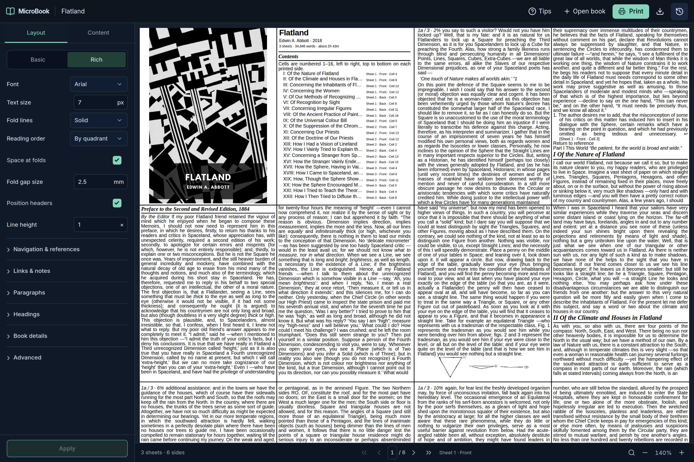

# MicroBook

**A whole book. A handful of sheets.**

Turn EPUB, Markdown, and plain-text books into compact PDFs for printing and folding. Adjust the layout, inspect the actual PDF, and print directly from your browser.



[Try the hosted beta](https://microbook.dovieweinstock.workers.dev) · [View the sample PDF](samples/alice-microbook.pdf) · [Install](#run-it-yourself) · [Print guide](docs/PRINT_REFINEMENTS.md) · [Release notes](RELEASE_NOTES.md)

_Screenshot and sample: Lewis Carroll’s Alice’s Adventures in Wonderland, illustrated by Arthur Rackham. This edition is public domain in the United States. [Source and attribution](samples/README.md)._

## Make it yours

- **Two layouts.** Basic keeps text compact; Rich preserves EPUB structure, headings, illustrations, captions, poetry, lists, and simple tables.
- **A real PDF workspace.** Scroll complete printed sides, select text, search the book, and jump to chapters or illustrations.
- **Print, without the detour.** Print the server’s completed PDF in the same app. Download a copy when you want one.
- **Control the paper.** Set font, text size, line height, fold guides, margins, paragraph spacing, and distinct chapter/part headings.
- **Make images work in print.** Include or remove illustrations, use one or two cells, rotate artwork, or turn repeated ornaments into compact flourishes. Adjust matching images together.
- **Compare image output.** Preview the original, grayscale, and laser-optimized versions. New books start with gentle laser optimization; original files stay untouched.
- **Keep useful EPUB features.** Configurable contents, bookmarks, links with printable URLs, notes, page references, and semantic formatting. Availability depends on the source book.
- **Pick up where you left off.** History retains current Basic/Rich PDFs. Keep named versions, return to earlier layouts, and restore your reading position.

The sidebar adapts to phones. Changes remain a draft until **Apply**; **Revert changes** restores the displayed layout. Failed or cancelled rendering keeps the previous PDF.

## Try the sample

[Open or download the complete illustrated Alice PDF](samples/alice-microbook.pdf): **7 printed sides / 4 duplex sheets**, Letter paper, Rich mode, 6 CSS px (4.5 pt) text.

This is the app’s actual output, including the source’s credits and license. [Sample settings and provenance](samples/README.md) let you reproduce it. Print at **100% / actual size**, with the printer’s multi-page-per-sheet option disabled. Test duplex direction and folding with one sheet before printing a whole book.

Tiny type is intentional and adjustable. What looks comfortable on screen may need a larger font on paper.

## Run it yourself

The **v2.0.0 release candidate** is being prepared. Until its container is published, build the current source:

```sh
git clone https://github.com/DovieW/microbook-maker.git
cd microbook-maker
docker compose -f docker-compose.production.yml up --build -d
```

Open **http://localhost:7777**. Docker is the only requirement for this installation. The container includes the browser and fonts used to render PDFs.

Books and PDFs persist in the `mbm-uploads` and `mbm-generated` Docker volumes. Do not use `docker compose down -v` unless you intend to delete them.

**Upgrading?** Back up both volumes and test their copies before switching images. Keep the old image and backup for rollback. See [deployment and upgrades](DEPLOYMENT.md).

MicroBook currently provides a **single shared Library per installation, without accounts**. Use it locally or behind private-network/access protection. Do not expose this build as an anonymous public upload service. The [Cloudflare beta](docs/PUBLIC_HOSTING.md) uses separate temporary browser storage and stateless cloud PDF creation.

## A short tour

1. **Open book** imports an EPUB, Markdown, or text file.
2. Use **Layout**, **Contents**, and **Images** to customize it.
3. Press **Apply** to render your changes.
4. Search or scroll through the PDF, then press **Print**.
5. Open **History** to switch books or keep a named version.

Rich supports reflowable EPUB 2/3. DRM-protected books are not supported; complex publisher layouts may need adjustment. Default paper is Letter, with 16 physical cells per printed side. Basic/Rich use the same folding geometry.

In the personal edition, print processing and storage happen on the server you run. In the hosted beta, books stay in temporary browser storage and prepared pages are sent to Cloudflare for PDF creation. Metadata lookup is an explicit optional action. Use books you have permission to process; public-domain status varies by country.

## Development and verification

Node 24 and Docker provide the reproducible development/test environment:

```sh
npm run mb -- setup
npm run mb -- dev --no-build
npm run mb -- check
npm run mb -- test --no-build --suite full
```

For a native environment with Chromium installed:

```sh
npm ci --ignore-scripts
npm run build
npm run dev
```

Set `PUPPETEER_EXECUTABLE_PATH` if Chromium is not found. Authoritative rendering comparisons use Docker’s pinned browser and fonts.

Tests cover source content, overflow, original Basic output, PDF geometry, browser workflows, cancellation/recovery, persistence, and public-domain books. See [verification](docs/VERIFICATION.md).

| Guide                                       | Contents                                       |
| ------------------------------------------- | ---------------------------------------------- |
| [Workspace](docs/WORKSPACE_REDESIGN.md)     | Navigation, drafts, History, printing          |
| [Images](docs/IMAGE_OUTPUT.md)              | Output, comparison, rotation and test printing |
| [EPUB features](docs/RICH_EPUB_FEATURES.md) | Source features and configurable behavior      |
| [Architecture](docs/ARCHITECTURE.md)        | Components, API and storage                    |
| [Deployment](DEPLOYMENT.md)                 | Installation, backups and rollback             |

## License

MicroBook’s software is licensed under [GNU GPL v3](LICENSE). Books and illustrations retain their own licenses; the software license does not grant rights to uploaded content. Bundled test illustrations are [CC0](resources/print-samples/LICENSE.md).
